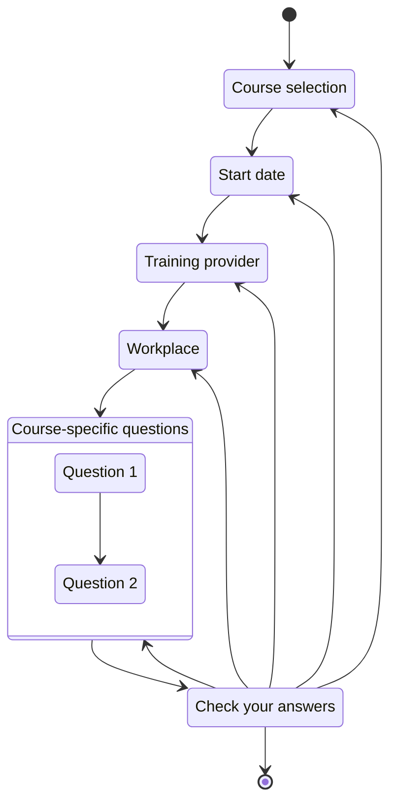
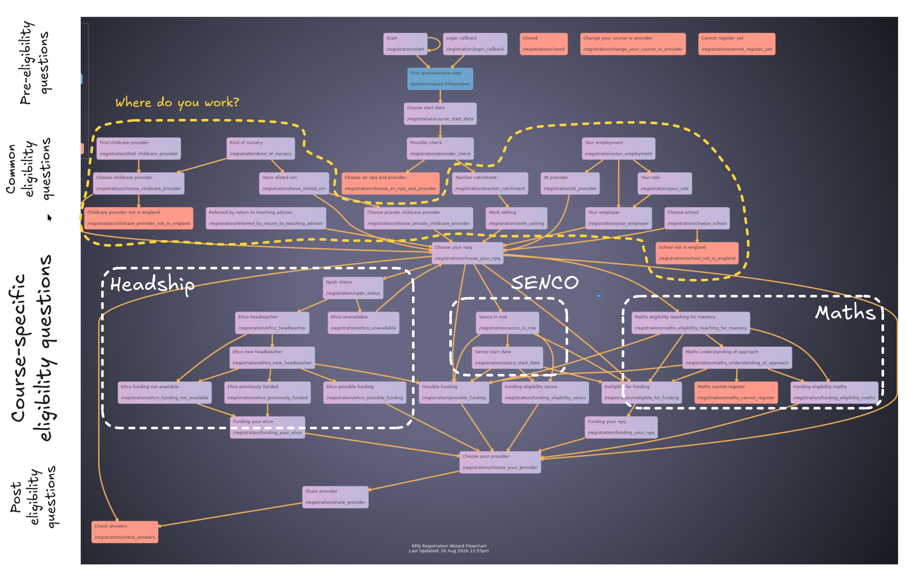
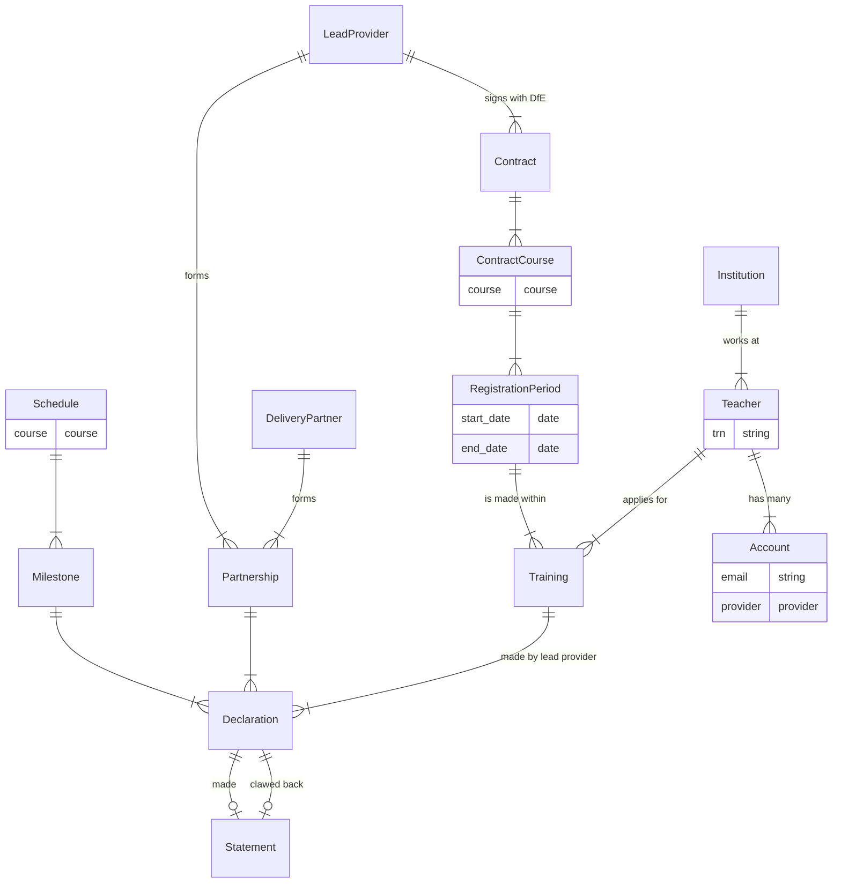

# NPX discovery

This isn't really [a discovery](https://www.gov.uk/service-manual/agile-delivery/how-the-discovery-phase-works), but it's an overview of the plans for combining NPQ and NPD into a single app. NPD was forked from NPQ, so the two codebases are already closely aligned.

> [!IMPORTANT]
> These decisions aren't final. This document will evolve.

## Registration flows

The NPD and NPQ registration journeys are currently very similar.

Ultimately, for every registration we want to know:

* who is registering
* what they're registering for
* when they want to start
* which provider they want
* where they work

For some courses we also need a few extra bits of information to check if they're eligible for funding.

The objective of merging NPQ and NPD is to remove duplication so we want **a single registration journey for all courses**.

The TTE team produced a [prototype registration journey editor](https://github.com/DFE-Digital/teacher-training-entitlement-board/issues/659) that demonstrated how it's possible to allow users to design and build their own journeys however we thought it offers too much flexibility keeping the settings in data rather than code could make versioning/releasing more complex.

Instead recording the extra questions a course needs in the course definition (see [here](#replace-the-courses-table-with-a-type)) will allow us to insert a custom sequence of questions into the main registration flow body. This approach enforces consistency across the common parts of all journeys while allowing extra questions to be asked only when necessary.



## Using data to make identifying the workplace easier

Lots of the NPQ registration journey and eligibility logic is focused on working out where someone works:



This is so the complex eligibility funding logic has all of the information it needs to make a judgement on whether someone qualifies or not.

We think if we had a better list of establishments covering not just [GIAS schools](https://get-information-schools.service.gov.uk/) and early years establishments, but young offenders institutions, hospital schools and any other place that qualify for funding, we might be able to reduce this part of the journey substantially - ideally to one question ('Where do you work?') for most people.

## Schedules and milestones

We would like to further explore using dynamic schedules rather than database driven ones.

Storing dates in the database does offer some advantages in that dates can be finely tuned and adjusted, but they come at the expense of having to calculate and import new ones every year.

Dynamic ones would instead be calculated based on the registration period's opening date, so we'd expect a `started` declaration to be submitted before `opening_date + X days` and a `retained-1` to be submitted `opening_date + Y days`.

## Data model

The data model doesn't need to change much but we have an opportunity to remove some historical debt and rename some things to avoid confusion.

### Proposed changes:

#### Replace the `courses` table with a type

Currently we have a courses table that contains the course's name, identifier, description, code ([NPQ](https://github.com/DFE-Digital/npq-registration/blob/f5d1c423bf1477885c38e61d2a430cc928738173/db/schema.rb#L280-L294), [NPD](https://github.com/DFE-Digital/teacher-training-entitlement/blob/96e7a6ff67d83684ee98f75ccafad6f7425ca087/db/schema.rb#L242-L255)).

To add a course we need to both create a row in the `courses` table and add code to various places in the application, notably in the course-specific eligibility logic. One won't work without the other and course information isn't changeable by admins, so the table doesn't really provide any benefits.

Instead, information about the course should be moved to the code and the course should be represented in the database by an enumerated type.

Each course would have its own class that references the type and defines its:

* code
* description
* group information
* questions we need to ask in the registration flow in order to determine eligibility
* registration and funding [eligibility logic](./eligibility-overview.md)
* declaration schedule

A course definition could look something like this:

```ruby
class NPQEarlyHeadshipCoachingOffer < Course
  IDENTIFIER            = "npq-early-headship-coaching-offer" # matches database enum
  NAME                  = "Early headship coaching offer"
  SHORT_CODE            = "EHCO"
  DECLARATIONS          = %i[started retained-1 retained-2 completed]
  SCHEDULE              = :one_year_4_declarations
  ELIGIBILITY_QUESTIONS = %i[referred_by_rtta]

  def eligible_for_course?(registration:)
    !registration.partiticpant.received_funding_for?(:npq_headship)
  end

  def eligible_for_funding?(registration:)
    instituion  = registration.institution
    participant = registration.participant
    cohort      = registration.cohort

    return :subject_to_review if institution.other_work_setting? && registration.referred_by_rtta?

    eligible = institution.in_england?
               && participant.has_not_been_funded_for_course(IDENTIFIER)
               && (cohort.capped_funding? || cohort.fully_funded?)
               && (
                 (institution.childcare? && institution.not_childminder?)
                 || (institution.eligible && institution.type.in?("school" "academy trust", "16-19 educational setting"))
               )

    eligible ? :yes : :no
  end
end
```

The benefits here are that:

* you can get a full overview of a course in one place
* changes made to the course are recorded in source control
* new courses are easy to add - create a new class and add a value to the enumerated type
* testing the eligibility logic will be much easier
* the overlapping logic code should be easily shareable with modules

#### Schema

The schema is very similar to the schemas that currently exist in NPQ and NPD.



#### Other changes:

Note, these are undecided, but might make more sense. These short descriptions will be expanded on.

1. **Application becomes training** - originally the NPQ registration service fed data to ECF which held the participant information and received declarations, etc. Since NPQ separation these things happen in the NPQ service itself, so the record represents the training as a whole rather than just the application for it.
2. **User becomes teacher** - teachers are the main group of people applying for course and they're identified by a Teacher Reference Number
3. **Declarations linked to partnerships** - normalising the relationship here means we don't need to store duplicative 'stamped' values on the declaration
4. **Introduction of `contract and contract_courses`** - lead providers sign contracts with DfE to provide courses over a given period of time, holding these in the data model makes it match reality more closely
